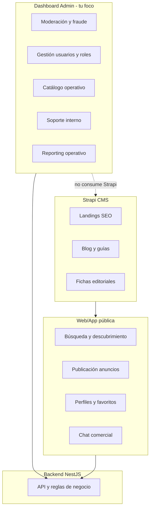

# Mapa funcional: Dashboard admin vs resto del ecosistema

## Criterio de clasificación

| Capa | Responsabilidad |
|------|-----------------|
| **Dashboard admin** (`wiauto-dashboard`) | Operación interna de la plataforma: moderar, configurar, auditar, dar soporte, gestionar catálogo operativo y usuarios del sistema. Usuarios: staff interno (admin, moderador, soporte). |
| **Strapi / CMS** | Contenido editorial y SEO: páginas de marketing, blog, guías, landings, textos enriquecidos. No lógica de negocio ni transacciones. |
| **Web / app pública** (marketplace) | Experiencia de comprador/vendedor final: buscar, publicar, favoritos, chat comercial, perfil de cuenta, alertas personales. |
| **Portal concesionario** (futuro, puede ser web separada) | Operativa del dealer: stock, leads, equipo, estadísticas propias. Distinto del panel interno de WiAuto. |
| **Backend NestJS** | API transaccional, reglas de negocio, persistencia, integraciones. Compartido por todas las capas. |
| **App móvil** | Experiencia nativa optimizada (cámara, push, publicación rápida). Consume backend; no duplica admin. |

---

## Estado actual de la dashboard (implementado hoy)

Según [`appSidebar.tsx`](file:///Volumes/IDAHIR/programacion/programacion/vite/wiauto-dashboard/src/components/layout/appSidebar.tsx):

| Módulo | Ruta | Estado |
|--------|------|--------|
| Inicio | `/` | Placeholder |
| Anuncios (CRUD admin) | `/vehicles` | Implementado (form multi-paso, filtros, historial precios) |
| Catálogo auxiliar vehículo | `/categories`, `/features`, `/cuotas`, `/tractions`, `/vehicle-types`, `/colors`, `/dgt-labels`, `/warranty-types`, `/catalog-services` | CRUD implementado |
| Soporte — tickets | `/tickets`, `/ticket-categories` | Implementado |
| Usuarios | `/users` | Implementado |
| Roles / permisos | `/role`, `/permissions` | Implementado |
| Concesionarios | `/dealership` | Implementado |
| Moderación | `/moderation` | Parcial (listado perfiles/usuarios) |
| Mensajes | `/messages` | Implementado (chat en tiempo real) |
| Config cuenta admin | `/profile/config` | Implementado |
| Auth | `/signIn` | Implementado |

**En backend pero sin UI en dashboard:** catálogo estructural automoción (marcas, modelos, generaciones, versiones, combustible, carrocería, años) — vive en [`catalog/`](file:///Volumes/IDAHIR/programacion/programacion/nestjs/wiauto-backend/src/contexts/vehicles/catalog/) del NestJS.

---

## 1. Funcionalidades que SÍ pertenecen a la Dashboard Admin

### A. Panel de administración (núcleo del ANEXO)

Del bloque *"Panel de administración"* y operaciones internas:

| Funcionalidad ANEXO | En dashboard | Estado / notas |
|---------------------|-------------|----------------|
| Moderación de anuncios | Sí | Parcial: CRUD anuncios + ruta `/moderation`; falta cola de revisión dedicada |
| Cola de revisión e historial de moderación | Sí | Pendiente |
| Gestión de usuarios y verificaciones | Sí | `/users`, `/moderation`; falta flujo verificación documental |
| Bloqueos y control de fraude | Sí | Parcial: suspensiones en backend; falta panel de riesgo |
| Gestión de pagos, planes, cupones y campañas | Sí | Parcial: CRUD `/cuotas` (planes financiación); faltan pagos, cupones, campañas, suscripciones |
| Gestión de incidencias y tickets | Sí | `/tickets`, `/ticket-categories` |
| Auditoría y permisos por rol | Sí | `/role`, `/permissions`; falta log de auditoría |
| Panel de riesgo interno | Sí | Pendiente |
| Dashboards internos negocio/operaciones | Sí | Pendiente (`/` es placeholder) |

### B. Confianza, seguridad y antifraude (vista operativa)

| Funcionalidad | Dashboard | Notas |
|---------------|-----------|-------|
| Moderación manual | Sí | Ampliar `/moderation` |
| Bloqueo anuncios dudosos | Sí | Acciones sobre `/vehicles` |
| Sistema de denuncias/reportes | Sí | Panel interno de revisión |
| Badges de verificación | Sí | Configuración y asignación manual |
| Detección precios anómalos | Sí | Alertas en panel interno (reglas en backend) |
| Verificación documental | Sí | Cola de revisión docs subidos por usuarios |

La **detección automática** vive en backend; la **revisión humana** en dashboard.

### C. Catálogo operativo del vehículo (master data, NO editorial)

| Funcionalidad ANEXO | Dashboard | Notas |
|---------------------|-----------|-------|
| Etiqueta ambiental, tracción, extras/equipamiento | Sí | `/dgt-labels`, `/tractions`, `/features` |
| Tipos vehículo, colores, garantías, servicios | Sí | Rutas existentes |
| Categorías de anuncio | Sí | `/categories` |
| Marca, modelo, generación, versión, motorización | Sí | **Pendiente UI**; backend catalog listo |
| Combustible, transmisión, potencia, etc. | Sí | Parte en formulario anuncio + catálogo backend |
| Ficha técnica enriquecida / comparación versiones | Parcial dashboard | Datos estructurados en admin/catalog; **presentación comparativa** en web pública |
| Coste estimado de uso | No dashboard | Cálculo/servicio backend + UI pública |

### D. Soporte (panel interno del ANEXO tickets)

| Funcionalidad | Dashboard | Estado |
|---------------|-----------|--------|
| Panel interno soporte y asignación por agente | Sí | `/tickets` |
| Categorías incidencia | Sí | `/ticket-categories` |
| Historial tickets por usuario | Sí | Desde detalle ticket / enlace a usuario |
| Estados ticket | Sí | En flujo ticket |

La **creación de tickets por el usuario** es web/app pública; la **gestión** es dashboard.

### E. Chat — bandeja centralizada (vista staff)

| Funcionalidad ANEXO | Dashboard | Notas |
|---------------------|-----------|-------|
| Bandeja centralizada vendedores | Sí (staff) | `/messages` — supervisión/soporte |
| Etiquetas y estados del lead | Sí | Extensión futura sobre mensajes |
| Respuestas rápidas y plantillas | Sí | Config admin |
| Chat multiagente | Sí | Gestión interna |

El **chat en tiempo real del comprador** es web/app pública; la dashboard es para operadores/concesionario staff.

### F. Gestión de concesionarios (operativa plataforma)

| Funcionalidad | Dashboard | Estado |
|---------------|-----------|--------|
| Alta/gestión concesionarios | Sí | `/dealership` |
| Equipo comercial / asesores | Parcial | Puede ampliarse en dashboard o portal dealer |
| Integración CRM/DMS | Config admin | Pantallas de integración en dashboard |

### G. Estadísticas y reporting (vista global admin)

| Funcionalidad ANEXO | Dashboard | Notas |
|---------------------|-----------|-------|
| Dashboards internos negocio y operaciones | Sí | KPIs globales: anuncios, leads, conversión |
| Exportación informes PDF/Excel | Sí | Herramienta admin |
| Métricas por concesionario (vista agregada) | Sí | Admin ve todos; dealer ve solo los suyos en portal |
| Comparativas entre periodos | Sí | Reporting admin |

Las **estadísticas por anuncio del propio vendedor** pueden vivir en portal concesionario/particular (web pública autenticada), no necesariamente en dashboard interna.

### H. Monetización (configuración, no checkout)

| Funcionalidad | Dashboard | Notas |
|---------------|-----------|-------|
| Planes premium / por volumen stock | Sí | Config planes y precios |
| Anuncios destacados | Sí | Config + moderación |
| Cupones y campañas | Sí | Gestión campañas |
| Escaparates de marca | Sí | Config comercial |

El **pago/checkout** del usuario ocurre en web pública; la **configuración** en dashboard.

### I. Identidad (solo capa admin)

| Funcionalidad | Dashboard | Notas |
|---------------|-----------|-------|
| Login staff, 2FA admin | Sí | `/signIn`, `/profile/config` |
| Recuperación cuenta staff | Sí | Flujo auth admin |
| Gestión multiusuario empresas | Parcial | Roles/permisos; invitaciones equipo en portal dealer |

Verificación email/teléfono de **usuarios finales** se gestiona desde web pública + vistas admin de verificación en dashboard.

---

## 2. Lo que NO es Dashboard — va a Strapi / CMS

Del ANEXO *"SEO, contenido y crecimiento orgánico"* y contenido editorial:

| Funcionalidad | Strapi | Por qué no dashboard |
|---------------|--------|----------------------|
| Landing pages SEO | Sí | Contenido marketing editable por no-devs |
| Blog / contenido editorial | Sí | Publicación de artículos |
| Guías de compra | Sí | Contenido largo, SEO, imágenes |
| Fichas de marca/modelo **editoriales** | Sí | Texto enriquecido, FAQs, imágenes hero ("Guía Audi A4 2024") |
| Comparativas automáticas **como contenido** | Sí | Artículos tipo "SUV vs berlina" |
| Páginas indexables concesionarios (SEO) | Híbrido | Ficha pública alimentada por backend; **textos SEO** en Strapi |
| Schema markup, URLs canónicas, paginación SEO | Web pública + Strapi | Strapi entrega contenido; Next/web renderiza |

**Distinción clave catálogo:**

- **Datos estructurados** (marca Audi, modelo A4, versión 2.0 TDI, 150 CV) → Backend + dashboard admin (master data).
- **Contenido editorial** ("Por qué comprar un Audi A4", comparativas narrativas, blog) → Strapi.

---

## 3. Lo que NO es Dashboard — Web / App pública (marketplace)

### Identidad, cuentas y onboarding (usuario final)

- Verificación email y teléfono (flujo usuario)
- Autenticación 2FA usuario
- Recuperación segura de cuenta
- Onboarding particular vs empresa

### Gestión avanzada de perfiles (cuenta del usuario)

- Perfil particular: anuncios, favoritos, búsquedas guardadas, historial contactos, seguimiento
- Perfil empresa: ficha pública, mapa, logo, descripción, stock visible
- Valoraciones y reseñas del concesionario (lectura pública + escritura usuario)
- Estadísticas de rendimiento **propias** del vendedor
- Gestión leads **propios** (bandeja del dealer)

### Publicación de anuncios (flujo vendedor)

- Autocompletado matrícula/VIN/marca-modelo
- Sugerencia automática de precio
- Detección campos incompletos
- Duplicar, programar, pausar, reactivar
- Estados: disponible, reservado, vendido
- Vídeos, etiquetas especiales (certificado, único dueño, etc.)

> **Nota:** Hoy el formulario multi-paso en dashboard es **herramienta admin** para gestionar anuncios. El flujo equivalente para el vendedor final irá en web/app pública (puede reutilizar componentes).

### Búsqueda avanzada y descubrimiento

- Búsqueda texto libre, semántica/IA, ordenación inteligente
- Recomendaciones, geolocalización, mapa, historial búsqueda
- Alertas y búsquedas guardadas multicriterio

### Favoritos, seguimiento y decisión de compra

- Favoritos por carpetas, timeline anuncio, indicadores oportunidad
- Historial de precio (lectura), tiempo publicado, score confianza
- Recordatorios contacto

### Chat, contacto y gestión comercial (lado comprador/vendedor)

- Chat tiempo real, fotos, documentos, ubicación
- Solicitud llamada, cita, prueba, financiación, tasación
- Integración WhatsApp/email (desde experiencia usuario)

### Sistema de alertas (usuario final)

- Alertas nuevos anuncios, bajada precio, cambio estado
- Alertas chat, citas, recordatorios
- Push, email, in-app configurables
- Centro de notificaciones en cuenta

### Tasación, pricing y servicios complementarios

- Tasador online, precio recomendado, rango mercado
- Financiación, garantías, informes historial, gestoría, entrega

Todo esto es **producto consumer/prosumer** en web/app, no panel interno WiAuto.

---

## 4. Lo que NO es Dashboard — App móvil

Del ANEXO *"Aplicación móvil"* (consumo backend, UI nativa):

- Subida fotos desde cámara optimizada
- Escaneo documentos
- Push avanzadas
- Guardar búsquedas, comparador móvil
- Gestión stock/leads móvil (dealer)
- Modo publicación rápida
- Deep links

La dashboard **no** se replica en móvil; como mucho un panel admin móvil sería fase muy tardía y mínimo.

---

## 5. Lo que vive en Backend NestJS (compartido)

Toda la lógica transaccional que alimenta dashboard + web + móvil:

- Auth JWT, permisos, suspensiones
- CRUD vehículos, vehicle_prices, catálogo
- Chat (WebSocket), tickets, notificaciones
- Filtros, búsqueda, OpenSearch
- Reglas antifraude, moderación, scoring
- Integraciones CRM/DMS, pagos, email queue
- IA: asistente búsqueda, redacción anuncios, pricing inteligente

La dashboard **consume** estos endpoints; no implementa la lógica.

---

## 6. Resumen ejecutivo para tu trabajo en dashboard

### Ya estás construyendo (continuar)

1. **Operaciones de anuncios** — listado, filtros, formulario completo, historial precios
2. **Catálogo operativo auxiliar** — 9 entidades CRUD
3. **IAM** — usuarios, roles, permisos
4. **Soporte** — tickets y categorías
5. **Concesionarios** — gestión básica
6. **Chat staff** — mensajes
7. **Auth admin** — login y config perfil

### Prioridades dashboard pendientes (del ANEXO)

1. **Home / dashboards KPI** — reemplazar placeholder `/`
2. **Moderación real** — cola revisión anuncios + historial decisiones
3. **Catálogo estructural UI** — marcas/modelos/versiones (backend ya existe)
4. **Fraude y verificaciones** — panel denuncias, docs, badges, precios anómalos
5. **Monetización admin** — planes, destacados, cupones, campañas (más allá de cuotas)
6. **Reporting** — exportaciones, métricas globales
7. **Auditoría** — log acciones admin
8. **Plantillas chat / leads** — extensión de `/messages`

### Explícitamente fuera de tu dashboard (no contar en scope)

- Todo el bloque SEO/contenido → **Strapi**
- Búsqueda, favoritos, alertas usuario → **Web pública**
- Publicación self-service vendedor → **Web/app pública** (reutilizar piezas)
- Tasación, financiación, servicios → **Web pública + backend**
- App móvil nativa → **Proyecto aparte**
- IA asistente/redacción → **Backend + UI pública** (admin solo configura si aplica)

### Zona gris (decidir pronto)

| Tema | Opciones |
|------|----------|
| Estadísticas dealer | Portal concesionario vs sección en web autenticada |
| Publicación anuncios | Mantener solo admin vs duplicar flujo en web vendedor |
| Ficha pública concesionario | Backend datos + Strapi textos SEO |

---

## Checklist de alineación (para ti)

- [ ] Usar este mapa como filtro: si una feature es "contenido editable por marketing" → Strapi
- [ ] Si es "operación interna WiAuto" → dashboard
- [ ] Si es "experiencia comprador/vendedor" → web/app pública
- [ ] Priorizar en dashboard: moderación, KPIs, catálogo marcas/modelos, fraude, monetización config
- [ ] No planificar landings/blog/guías en React dashboard
